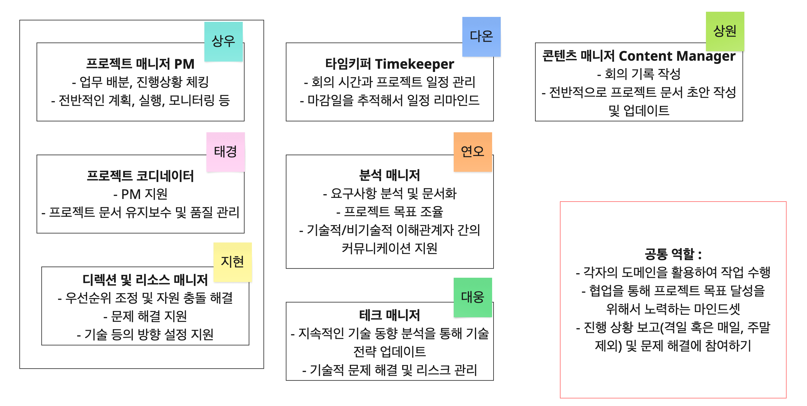

# Team Tech4Good 

---

## 1. 팀 이름 선정 이유와 배경

-   **팀 이름**: Tech4Good

-   **선정 이유**:
    -   **의미와 상징성**: "Tech4Good"는 기술(Tech)을 사회적 가치 실현(For Good)에 기여하는 도구로 활용한다는 핵심 철학을 담았습니다. 특히 유엔의 AI4Good 프로그램에서 영감을 받아 기술의 윤리적 활용과 지속가능발전목표(SDGs) 연계를 강조하고자 해서 선정했습니다.
    -   **목표 및 비전**: 공익 목적의 솔루션을 통해서 다양한 사회 문제 해결을 지향하고자 하며, "기술로 더 나은 미래를 설계"하면서 같이 성장하고자 합니다. 

-   **배경**:
    -   **선정 과정**: 초기 브레인스토밍에서 사회적 가치 지향성(SDGs 연계), 기술의 포용성(다양성 강조), 글로벌 협력(유엔 이니셔티브 반영)을 키워드로 후보를 도출했습니다.
    -   **후보 비교**:
        1.  당신에게 전하는 명쾌한 해답, 솔루션
        2.  공존사회연구소 (다양한 집단을 가진 사람들을 위해 연구한다는 의미)
        3.  Solucination (Solution + Hallucination: 거짓과 착각이 가득한 세상에 솔루션을 제공)
    -   **의견 조율**: 팀원 간 익명 투표를 진행하여 팀명을 'Tech4Good'으로 확정하였습니다.

---

## 2. 각 팀원의 역할

---

## 3. 협업 방식 및 커뮤니케이션 도구

-   **핵심 협업 방식**:
    -   **주간 회의**: 매주 [요일] [시간] (예: 월요일 오전 10시)에 진행하며, 진행 상황 공유 및 주요 이슈를 논의합니다.
    -   **작업 관리**: 협업도구 미로(Miro)를 사용하여 칸반(Kanban) 보드 방식으로 작업을 관리하고 추적합니다.
    -   **코드 리뷰**: 모든 코드는 Pull Request(PR)를 통해 과반수의 리뷰를 거친 후 병합하는 것을 원칙으로 합니다.
    -   **회의 기록**:
        -   회의 중 논의된 내용은 타임키퍼, 콘텐츠 매니저가 주도하여 **Notion**에 정리합니다.
        -   정리된 회의록은 최종적으로 **GitHub**에 공식 문서로 기록하여 관리합니다.
    -   **의사결정**: 주요 의사결정은 팀 논의를 통한 **다수결**을 기본으로 하되, 최종 결정은 **팀 리더**가 내립니다. 

-   **커뮤니케이션 도구 및 활용**:

| 도구        | 목적 및 주요 활용                                                                 | 장점                      | 한계/주의점             |
| :---------- | :-------------------------------------------------------------------------------- | :------------------------ | :---------------------- |
| **Discord** | **(주요 소통 채널)** 실시간 채팅, 음성 회의, 화면 공유, 프로젝트 관련 기록/전달사항 아카이빙 | 회의 가능, 카테고리 구분 가능 |                         |
| **Notion**  | 회의록 초안 작성, 피드백 기록, 일정 기록, 팀 정보 관리, 아이디어 정리                 | 유연한 정보 관리          |                         |
| **GitHub**  | **(공식 기록 저장소)** 프로젝트 코드 관리, 이슈 트래킹, 최종 회의록 및 공식 문서 저장   | 공식 포트폴리오로 활용 가능 | 형식 갖춰야 함          |
| **Miro**    | 아이디어 구상, 브레인스토밍, 디자인 협업, 진행 상황 시각적 트래킹                    | 동시 작업 용이            |                         |
| **카카오톡**| **(보조 소통 채널)** 간단한 소통, 가벼운 전달사항                                    | 접근성 높음               | 검색 어려움, 공사 구분 모호 |
| **Zoom/Google Meet** | 공식적인 화상 회의, 외부 협업자와의 미팅                                     |                           |                         |
| **Canva**   | (필요시) 간단한 디자인 작업, 피피티 제작                                          | (피피티 제작 외 소통 어려움) |                         |

-   **기타 커뮤니케이션 규칙**:
    -   **응답 시간**: 팀 내부 연락(Discord, 카카오톡 등)은 **24시간 이내 응답**을 원칙으로 합니다.
    -   **카카오톡 확인**: 카카오톡 메시지 확인 시 **이모지 등으로 확인 표시**를 합니다.
    -   **카카오톡 검색**: 카카오톡에서 프로젝트 관련 중요 전달사항은 **`[전체]` 키워드를 포함**하여 추후 검색이 용이하도록 합니다.

---

## 4. 비전과 성장 계획

-   **우리의 비전**:
    > "기술을 통해 누구나 가치를 누릴 수 있는 사회를 만드는 데 기여하자."

-   **앞으로의 성장 계획**:
    -   팀 역량 강화를 위한 스터디 운영
    -   외부 컨퍼런스 참여
    -   팀원들의 역량 향상을 기한 기술 스택 학습

---